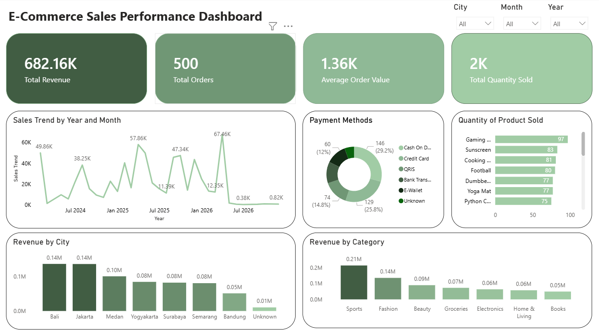

# 🛒 E-Commerce Sales Performance Analysis

## 📌 Project Overview

This project analyzes an e-commerce sales dataset containing messy transactional data to uncover business insights through **data cleaning, exploratory data analysis (EDA), and dashboard visualization**.

The project simulates a real-world analytics workflow, beginning with raw, inconsistent data and ending with actionable business insights through SQL and Power BI.

---

## 🎯 Business Problem

E-commerce businesses generate large amounts of transactional data, but inconsistent and messy data often makes analysis difficult.

The goal of this project is to:

- Clean and standardize messy sales data
- Identify sales trends and customer purchasing behavior
- Analyze product and regional performance
- Detect anomalies and high-value transactions
- Create an interactive dashboard for business monitoring

---

## 📂 Dataset Description

The dataset represents fictional but realistic **e-commerce transaction data** and includes intentionally messy values to simulate real-world business scenarios.

### Dataset Features

- Duplicate order IDs
- Missing values
- Inconsistent customer name formatting
- Incorrect product category spelling
- Mixed date formats
- Currency values stored as text
- Duplicate transactions

### Main Columns

| Column | Description |
|--------|-------------|
| order_id | Unique order identifier |
| order_date | Date of transaction |
| customer_name | Customer full name |
| city | Customer city |
| product_name | Purchased product |
| product_category | Product category |
| quantity | Number of products purchased |
| payment_method | Payment method |
| total_price | Total transaction amount |

---

## 🧹 Data Cleaning Process

Data cleaning was performed using **MySQL**.

### Cleaning Steps

✅ Removed duplicate rows

✅ Standardized customer name formatting

✅ Fixed inconsistent product category names

Example:

```text
b00ks → books
fashi0n → fashion
```

✅ Converted currency format

Example:

```text
Rp 3,570,560 → 3570560
```

✅ Standardized date formatting

✅ Handled missing values

✅ Resolved duplicate order IDs

---

## 📊 Exploratory Data Analysis (EDA)

EDA was conducted using **SQL** to answer business-related questions.

### Analysis Performed

### Sales Performance
- Total revenue
- Revenue by product category
- Monthly revenue trends
- Revenue contribution percentage

### Customer Behavior
- Most popular payment methods
- Highest spending customers
- Average order value

### Geographic Analysis
- Revenue by city
- Best-performing category by city

### Product Analysis
- Top-selling products
- Product performance comparison

### Statistical Analysis
- Outlier detection for unusual transactions
- Monthly growth analysis using SQL window functions

---

## 📈 Dashboard

### Dashboard Title
**E-Commerce Sales Performance Dashboard**

The Power BI dashboard includes:

- KPI cards
- Revenue trends
- Category performance
- City-level sales analysis
- Payment behavior
- Product performance
- Interactive filtering

### Dashboard Preview

(Add dashboard screenshots here)

Example:

```md

```

---

## 💡 Key Insights

Example findings:

- Electronics generated the highest revenue contribution.
- Certain cities significantly outperformed others in sales.
- Cash On Delivery was the most preferred payment method.
- Several high-value transactions were identified as outliers.

---

## 🛠 Tools Used

- **MySQL** → Data Cleaning & EDA
- **Power BI** → Dashboard Visualization
- **Excel / CSV** → Data Source
- **GitHub** → Project Documentation

---

## 📁 Project Structure

```text
E-Commerce-Sales-Analysis/
│── data/
│   ├── raw_dataset.csv
│   ├── cleaned_dataset.csv
│
│── sql/
│   ├── data_cleaning.sql
│   ├── eda_queries.sql
│
│── dashboard/
│   ├── ecommerce_dashboard.pbix
│
│── images/
│   ├── dashboard_preview.png
│
│── README.md
```

---

## 🚀 How to Reproduce This Project

### 1. Clone Repository

```bash
git clone https://github.com/yourusername/ecommerce-sales-analysis.git
```

### 2. Import Dataset into MySQL

Import the raw CSV file into MySQL Workbench.

### 3. Run SQL Scripts

Execute:

```sql
data_cleaning.sql
```

Then:

```sql
eda_queries.sql
```

### 4. Open Power BI Dashboard

Open:

```text
ecommerce_dashboard.pbix
```

---

## 👤 Author

**Muhammad Afif Taimullah**

Aspiring Data Analyst passionate about:
- Data Analytics
- SQL
- Business Intelligence
- Dashboard Development

GitHub: (your GitHub link)  
LinkedIn: (your LinkedIn link)
